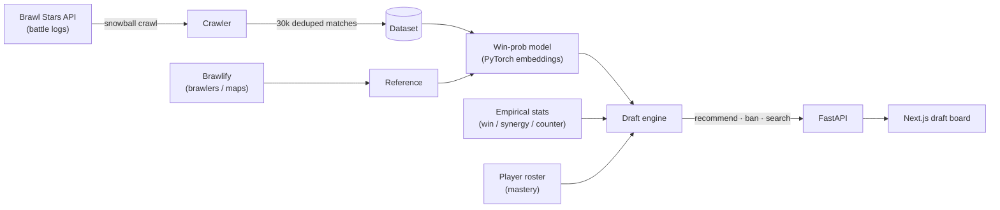

# ⚔️ Brawl Draft — AI Ranked Draft Assistant

An AI-powered draft assistant for **Brawl Stars Ranked**. It recommends bans and picks in
real time using a win-probability model trained on **1,000,000+ real ranked matches**, fused
with empirical map statistics — and goes well beyond the usual "win-rate + synergy + counter"
tools with a **model that reads unfinished drafts natively**, **composition warnings**, and
**per-player roster mastery**.


> **Status:** feature-complete. Built as a practical drafting tool *and* an end-to-end ML
> portfolio project — data pipeline → trained model → search/optimization → product.

<!-- Add a screenshot of the running app to docs/screenshot.png, then restore:  -->
> 🎮 Map select → ban/pick → real-time, explainable recommendations. Run it locally via the [Quickstart](#quickstart).

---

## Why it's different

Most draft tools reduce a pick to `map win-rate + pairwise synergy + pairwise counters`.
This project keeps that as a *baseline* and adds layers that no single competitor combines:

| Layer | What it does |
| --- | --- |
| 🎯 **Win-probability model** | Learned brawler + map embeddings predict `P(win)` for any 3v3 vs 3v3 on any map. Calibrated (ECE ≈ 0.01). |
| 🔮 **Partial-draft native** | Trained on masked comps, the model scores the board *as it stands* — first pick, mid-snake, or blind pick — marginalizing over how real drafts continued from that position. No fill-in guesses, no separate search pass. |
| ⚖️ **Composition warnings** | Flags comp holes: no frontline, no long range, double-tank, "enemy is tank-heavy — bring a Marksman," mode-specific advice. |
| 👤 **Roster readiness** | Personalizes to *your* account: restricts to brawlers you can field, prices power and missing build pieces — including released **Buffies** — and conservatively nudges from your own record. |
| 🔍 **Explainability** | Every suggestion shows its objective signals, sample confidence, and the signed account adjustments that turn the meta baseline into your score. |

## Features

- **Ban + pick phases** with a clickable draft board (6 bans, 3v3, unique picks).
- **Live recommendations** that re-rank instantly as the draft fills in.
- **Map-aware**: 100+ maps across the 6 current ranked modes, with per-map stats.
- **Personalize toggle** for roster readiness and account history.
- **Transparent scoring** — no black box; every number is shown.

## Architecture



## How it works

> Live version, with diagrams and the held-out numbers: **[brawldraft.com/model](https://brawldraft.com/model)**.

**1. Data.** The official API is player-centric, so a snowball crawler seeds top players from
the leaderboards, harvests the other 5 tags from every ranked match, and dedupes by a stable
match key (the same match appears in up to 6 players' logs). Result: 30k+ labeled
`(map, team A, team B) → winner` rows.

**2. Win-probability model.** A small PyTorch network with learned brawler, map, and mode
embeddings. The key design choice is an **antisymmetric** head that outputs the logit of
$P(A \text{ wins})$ given the map/mode context $c$:

$$
\mathrm{logit}(A, B \mid c) = \underbrace{S(A, c) - S(B, c)}_{\text{team strength}} \;+\; \underbrace{P_A \cdot Q_B - P_B \cdot Q_A}_{\text{directed counters}}
$$

$$
c = [\,e_{\text{map}},\ e_{\text{mode}}\,], \qquad
S(T, c) = \mathrm{MLP}\!\big(\big[\, \tfrac{1}{|T|}\sum_{b \in T} E_b,\ c \,\big]\big), \qquad
P_T = \sum_{b \in T} p_b, \quad Q_T = \sum_{b \in T} q_b
$$

where $E_b$ is a learned brawler embedding, $[\,\cdot,\,\cdot\,]$ is concatenation, and
$p_b, q_b \in \mathbb{R}^{16}$ are low-rank **attacker / defender** vectors whose dot products encode
directed matchups. Every term flips sign when the teams are swapped, so
$\mathrm{logit}(B, A \mid c) = -\,\mathrm{logit}(A, B \mid c)$ and therefore

$$
P(A \text{ wins}) + P(B \text{ wins}) = \sigma(z) + \sigma(-z) = 1
$$

holds **by construction** — no team-order bias and no global offset to learn. The bilinear counter
term captures specific matchups (brawler X beats Y) that a pure strength model can't express.

**3. Draft engine.** Given a draft state, it fuses the model with empirical map win-rates,
synergy, counters, and role-fit into a transparent, *renormalized* weighted average over only the
objective signals that are **active** so far (synergy needs allies; counters need a revealed
enemy):

$$
\mathrm{base}(b) = \frac{\sum_{k \in \mathcal{A}} \omega_k\, v_k(b)}{\sum_{k \in \mathcal{A}} \omega_k}, \qquad
\mathcal{A} \subseteq \{\, \text{map},\ \text{model},\ \text{counter},\ \text{synergy},\ \text{role} \,\}
$$

When an account is loaded, signed post-adjustments turn that common baseline into the personal
score: a readiness deficit for power/loadout/Buffy gaps, a measured item edge when available, and
a tightly capped personal-history edge. Mastery is shown as context rather than mixed into the
objective blend, so the meta and personal percentages stay comparable.

The model reads **unfinished drafts natively**. During training, every match is also shown with
random slots hidden behind a learned *unknown-slot* embedding $e_{\varnothing}$, drawn across the
draft states a real snake produces, so the net learns

$$
f_\theta(A, B \mid c) \;\approx\; \Pr\bigl(\text{win} \;\bigm|\; A \subseteq A^\*,\ B \subseteq B^\*,\ c\bigr)
$$

for any partial board $(A, B)$ — the probability marginalized over how real ranked drafts
containing those picks actually finished ($A^\*, B^\*$ are the completed teams). Mid-draft, a
candidate's model signal is therefore its win probability *given everything on the board and
nothing more*: no top-meta fill-ins, no simulated opponent. Antisymmetry survives masking, so an
empty board is exactly $0.5$ by construction.

**4. App.** A FastAPI backend serves the engine; a Next.js board calls it and renders live,
explainable recommendations.

See [`docs/MODEL_CARD.md`](docs/MODEL_CARD.md) for the full methodology, training, and evaluation.

## Results

Held-out validation on 158,966 of 1,059,778 matches (lower log-loss/ECE is better; higher
AUC/accuracy is better), full comps:

| Model | Log-loss | Accuracy | AUC | ECE |
| --- | --- | --- | --- | --- |
| Always 0.5 | 0.6931 | 0.500 | – | – |
| Logistic regression (brawler presence) | 0.6852 | 0.550 | 0.570 | – |
| **Embedding net** | **0.6674** | **0.588** | **0.625** | **0.009** |

And on unfinished boards, the same net's log-loss falls monotonically as picks land —
0.6908 with one known pick, 0.6781 at 2v2, 0.6674 at the full 3v3 — with calibration
holding near 0.01 at every state (see `docs/metrics.json`).

The embedding net beats both baselines and is **well-calibrated**. The absolute AUC is modest
*by nature of the problem*: at top ladder both teams draft competently and the outcome is
mostly decided by in-game skill, so the draft explains only a slice of the result. That's why
the tool ranks picks by *marginal* win-probability and fuses the model with lower-variance
empirical signals, rather than trusting any single number.

## Tech stack

- **ML / backend:** Python · PyTorch · scikit-learn · FastAPI
- **Data:** official Brawl Stars API (custom async crawler) + [Brawlify](https://brawlapi.com) for reference data & images; stored as JSONL/Parquet
- **Frontend:** Next.js · React · TypeScript · Tailwind CSS

## Project structure

```
backend/
  bsdraft/
    api/         FastAPI app (reference + recommend + roster)
    collect/     Async crawler: client, snowball, match parser, dedup
    data/        Reference loaders, encoders, dataset builder
    models/      PyTorch win-probability model + serving
    engine/      Stats, fused scoring, bans, warnings, mastery
  scripts/       collect.py · train.py · export_model.py · smoke_test.py
frontend/        Next.js draft board
data/reference/  Brawlers, maps, modes, class overrides (committed)
deploy/          launchd sample for the home crawler (render.yaml + keepwarm.yml at root)
docs/            Model card, methodology, charts
```

## Quickstart

```bash
# 1. Backend (Python 3.11+)
python3 -m venv .venv && source .venv/bin/activate
pip install -r backend/requirements.txt
cp .env.example .env          # add BRAWLSTARS_API_TOKEN + PLAYER_TAG

# 2. Collect data and train (one-time; needs an API key)
PYTHONPATH=backend python backend/scripts/collect.py --target 30000
PYTHONPATH=backend python backend/scripts/train.py
PYTHONPATH=backend python backend/scripts/export_model.py   # winprob.pt -> winprob.npz (served in NumPy)

# 3. Run the app
PYTHONPATH=backend uvicorn bsdraft.api.main:app --port 8000     # backend
npm --prefix frontend install && npm --prefix frontend run dev  # → http://localhost:3000
```

> Get a free API key at [developer.brawlstars.com](https://developer.brawlstars.com). Keys are
> IP-locked — allow the public IP of the machine running the crawler.

## Deployment — free, self-updating public site

The live site costs **$0/mo** and refreshes its data while in use. The constraint is the
IP-locked API key: the **crawler stays on a machine whose IP is on the key's allow-list** and
*publishes* data to a GitHub Release; a free cloud API *pulls* it on an interval and hot-swaps
rebuilt stats/model artifacts — no restart, and no key in the cloud.

```text
your machine            GitHub Release           Render (free)        Cloudflare Pages
collect.py --loop  ──▶  matches.jsonl.gz   ──▶   FastAPI: sync +   ◀──  Next.js board
(IP-locked key)         (tag: data-latest)       rebuild stats         (public URL)
```

The API serves the model in **pure NumPy** (exported `winprob.npz`, no torch), so it fits
Render's free 512 MB tier and cold-starts fast; PyTorch is used only for *training*, locally.

1. **Publish a dataset** (creates the `data-latest` release on first run):
   ```bash
   PYTHONPATH=backend python backend/scripts/export_model.py            # commit winprob.npz
   PYTHONPATH=backend python backend/scripts/collect.py --target 2000 --publish
   ```
2. **Backend → Render.** New → Blueprint → this repo (uses [`render.yaml`](render.yaml), free
   plan). It sets `DATA_URL` to the release asset and `REFRESH_SECONDS=600`. No API token needed.
3. **Frontend → Cloudflare Pages.** Create a Pages project from this repo with **root
   directory** `frontend`, **build command** `npx next build`, **output directory** `out`
   (the app is a static export). Add a build-time variable `NEXT_PUBLIC_API_BASE` = your
   Render URL (it's inlined at build, so it must be set before the build runs).
4. **Keep it warm.** Free instances sleep after ~15 min idle; set repo variable
   `RENDER_HEALTH_URL` = `<render-url>/api/health` to enable
   [`keepwarm.yml`](.github/workflows/keepwarm.yml).
5. **Run the home crawler** so data keeps flowing and drift-triggered retrains run in GitHub
   Actions instead of on your machine:
   ```bash
   PYTHONPATH=backend python backend/scripts/collect.py --loop 3600 --target 800 --publish --dispatch-retrain-on-shift
   ```
   Or install it as a login agent (macOS): edit the paths in
   [`deploy/com.bsdraft.crawler.plist`](deploy/com.bsdraft.crawler.plist), copy to
   `~/Library/LaunchAgents/`, then `launchctl load` it.

6. **Model retrains.** A shifted meta dispatches
   [`retrain-model.yml`](.github/workflows/retrain-model.yml), which downloads the published
   dataset, runs `train.py --class-synergy --candidates 3 --max-full-delta 0.0035`, exports
   `winprob.npz`, and uploads the model only if the regression/capability gates pass. This keeps
   the laptop crawler light while preserving the no-regression release path.

> **Tradeoffs.** The site stays up on the cloud, but data only advances while your crawler
> machine is on (watch `matches` / `last_change` at `/api/health`). **Roster/mastery
> personalization is local-only** — it needs a live call to the IP-locked key, which can't run
> from the cloud, so the public site runs without it.

## Roadmap

- [x] Data pipeline · win-prob model · draft engine · web app
- [x] Partial-draft-native model · composition warnings · roster mastery
- [x] Continuous data refresh · free, self-updating public deployment (NumPy serving)
- [ ] Best-of-3 series awareness · map-geometry features

## Credits

- Official Brawl Stars API — <https://developer.brawlstars.com>
- [Brawlify / BrawlAPI](https://brawlapi.com) for reference data & images
- Prior art / inspiration: [DraftStars](https://github.com/mcmckinley/DraftStars)

Not affiliated with, endorsed by, or sponsored by Supercell. *Brawl Stars* is a trademark of
Supercell Oy.

## License

[MIT](LICENSE) © 2026 [Mitchell Tatge](https://github.com/mctatge)
